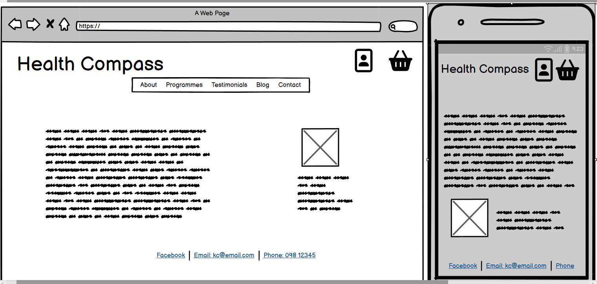
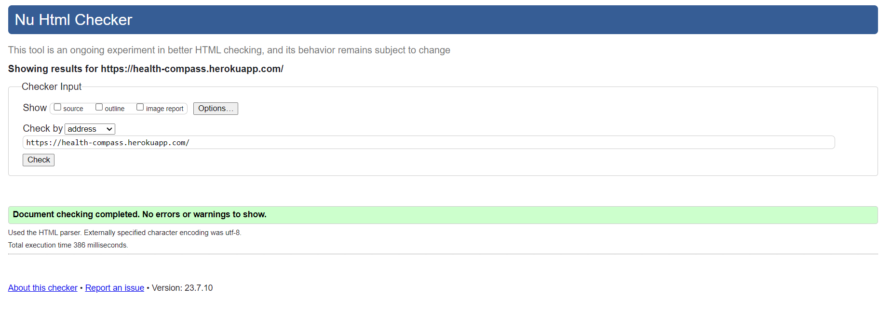
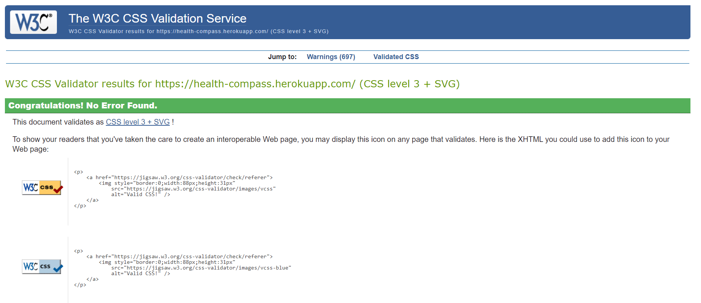
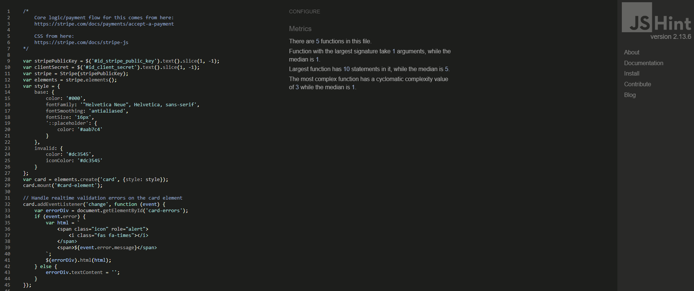
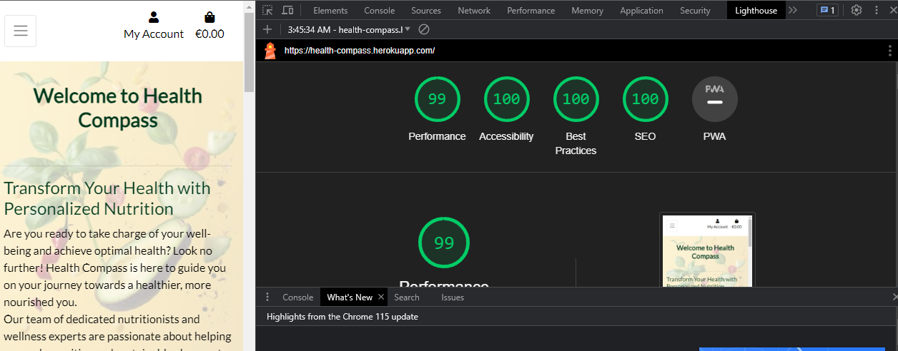

# Health Compass

## A Nutrion and Lifestyle Consultation Site
>A site to purchase nutrition and lifestyle coaching programmes from experienced and qualified nutritionists.


## [Live site](https://health-compass.herokuapp.com/) | [Repository](https://github.com/MichelleCorrigan/health-compass)

---

## Contents
* [Introduction](#introdution)
* [Business Model](#business-model)
* [User Stories](#user-stories)
* [Design](#design)
  * [Colour Scheme](#colour-scheme)
  * [Wireframes](#wireframes)
  * [Images](#images)
  * [Fonts](#fonts)
* [Technologies Used](#technologies-used)
* [Deployment](#deployment)
  * [Create an external database](#create-an-external-database)
  * [Create Heroku App](#create-heroku-app)
  * [Forking the Repository](#forking-the-repository)
  * [Creating a Clone](#creating-a-clone)
* [Testing](#testing)
* [Bugs](#bugs)
* [Credits](#credits)
* [Features to implement in the future](#features-to-implement-in-the-future)
---

## Introduction
The aim of this project is to build a Full-Stack e-commerce site based on business logic used to control a centrally-owned dataset. I will set up an authentication mechanism and provide role-based access to the site's data or other activities based on the dataset.
This project is a health and wellness site offering programmes for personal consultation services, aimed at those wishing to improve various aspects of their health, including weight-loss/gain, better sleep and stress management.

## Business Model
Health Compass is a Business-to-Customer ( B2C ) e-commerce consultation site. As the majority of it's user's would be coming from online search engines, strongly implemented SEO is of high importance. Therefore it was important to include the following:
- a robots.txt file
- a sitemap.xml file
- rel attributes on links to external sites
- descriptive meta tags with short and long tail keywords

  - Adding a Newsletter subscription form, Testimonials, secure payments with Stripe, a Privacy Policy and an easy way to get in Contact increase customer trust and satisfaction, hopefully leading to customer referrals.
  - Creating a Facebook Business page is an easy way for friends, family and satisfied customers to share/like the page increasing Brand Reach. Regular content, as well as advertising special offers/discounts can entice potential customers.

## User Stories
- User stories have been mapped using a Github project board and can be viewed here:
[Project Board for Health Compass](https://github.com/users/MichelleCorrigan/projects/3)

## Design
The site has a simple and clear design, making it easy and enjoyable to navigate through.

### Colour Scheme
The predominant background of a warm yellow was chosen to convey sunshine and warmth, the splashes of green in the background and the green logo-text convey life and health. The overlay and black-text establish a contrast to enhance user accessibility.

### Wireframes

<details>

 <summary>Home Page</summary>

 

</details>

### Images

A background image of various fruit and vegetables scattered on a yellow background, rendered to 50% transparency, was used across the site.

<details>
 <summary>Background Image</summary>


</details>

### Fonts
The main font used is Lato and Sans Serif as the backup font if the imported font doesn't load. Fonts were imported from [Google Fonts](https://fonts.google.com/)

---

## Technologies Used

- HTML
- CSS
- JavaScript
- Python
- Django
- Bootstrap
- Crispy forms

- ElephantSQL
- Heroku
- Git
- Github
- AWS storage

---

## Deployment

### Create an external database
1. Log in to [ElephantSQL](https://www.elephantsql.com/)
2. Click Create New Instance
3. Give your plan a Name, select the free plan, click Select Region
4. Select data-center nearest you, click Review
5. Check all details are correct then click Create Instance
6. Return to dasboard, click on your new database, copy the database URL to your clipboard

### Create Heroku App
1. Log in to [Heroku](https://www.heroku.com)
2. Click New, select New app
3. Name your app, select region closest to you, click Create app
4. In Settings, reveal Config Vars
5. Add a new config var named DATABASE_URL, paste in the URL from ElephantSQL as the value

In your IDE terminal install:
  `pip3 install dj_database_url==0.5.0 psycopg2`
 
Update requirements.txt file:
  `pip freeze > requirements.txt`

Add the DATABASE_URL to your env.py file or environment variables in gitpod

Go to settings.py and  `import dj_database_url` underneath the import for os

Comment out the default  `DATABASES`  setting, add the following underneath:

``` DATABASES = {
    'default': dj_database_url.parse(os.environ.get('DATABASE_URL')) }

```
In the terminal:
1. Run migrations
2. Create a superuser

Return to settings.py and delete the previous Databases entry, un-commenting out the default setting

In the root directory of your project, create a file called "Procfile" and add  `web: gunicorn project_name.wsgi` 
    
In settings.py 
1. Add ['app_name.heroku.com', 'localhost'] to  `ALLOWED_HOSTS`
2. Add the key value of: `DISABLE_COLLECTSTATIC`  and set it to 1. When you have  staticfiles to push then remove this variable
3. Set `DEBUG = 'DEVELOPMENT' in os.environ`
    
Commit and push these changes to GitHub

Then use `git push heroku main` to deploy to Heroku

In the Heroku deploy tab, connect to Github, connect to your repository and enable automatic deploys

In the settings tab, update the config vars with the following:

| Key | Value  |
| -- | -- |
|AWS_ACCESS_KEY_ID|From AWS in CSV Download|
|AWS_SECRET_ACCESS_KEY|From AWS in CSV Download|
|DATABASE_URL|From ElephantSQL dashboard|
|SECRET_KEY|Randomly Generated Django Key|
|USE_AWS|True|

Click on open app at the top of the page to view your deployed app

### Forking the Repository
By forking the GitHub Repository we make a copy of the original repository on our GitHub account to view and/or make changes without affecting the original repository by using the following steps...

1. Log into [GitHub](https://github.com/login) or [create an account](https://github.com/join).
2. Locate the [GitHub Repository](https://github.com/MichelleCorrigan/health-compass).
3. At the top of the repository, on the right side of the page, select "Fork"
4. You should now have a copy of the original repository in your GitHub account.

### Creating a Clone
How to run this project locally:
1. Install the [GitPod Browser](https://www.gitpod.io/docs/browser-extension/) Extension for Chrome.
2. After installation, restart the browser.
3. Log into [GitHub](https://github.com/login) or [create an account](https://github.com/join).
4. Locate the [GitHub Repository](https://github.com/MichelleCorrigan/health-compass).
5. Click the green "GitPod" button in the top right corner of the repository.
This will trigger a new gitPod workspace to be created from the code in github where you can work locally.

How to run this project within a local IDE, such as VSCode:

1. Log into [GitHub](https://github.com/login) or [create an account](https://github.com/join).
2. Locate the [GitHub Repository](https://github.com/MichelleCorrigan/health-compass).
3. Under the repository name, click "Clone or download".
4. In the Clone with HTTPs section, copy the clone URL for the repository.
5. In your local IDE open the terminal.
6. Change the current working directory to the location where you want the cloned directory to be made.
7. Type 'git clone', and then paste the URL you copied in Step 3.
```
git clone https://github.com/USERNAME/REPOSITORY
```
8. Press Enter. Your local clone will be created.

Further reading and troubleshooting on cloning a repository from GitHub [here](https://docs.github.com/en/free-pro-team@latest/github/creating-cloning-and-archiving-repositories/cloning-a-repository)

---

## Testing

### Common Elements Testing
Manual testing was conducted on the following elements:

- Test that Logo redirects to home screen.
- Test that Nav Links work.
- Test that External Links work and open in a new page.
- User registration, login and logout all work.
- CRUD functionality only available when Superuser logged in.
- Invalid forms give error message explaining why it is invalid.
- Valid forms submitted have a success message relayed to user.


### Validation

#### HTML and CSS were validated using the [W3C Validator](https://validator.w3.org/)
  - HTML - all clear
    <details>

      <summary>HTML validation</summary>

      
 
    </details>

  - CSS - all clear
    <details>

      <summary>CSS validation</summary>

      
    
    </details>

#### JavaScript code was tested on [Jshint](https://jshint.com/)
  - JS - no errors

    <details>

      <summary>JavaScript validation</summary>

      
      
    </details>

##### Python was validated using the flake8 linter in the terminal

#### Lighthouse validation was run, with the following results;
 - Showing good scores throughout the site

    <details>

      <summary>Lighthouse validation</summary>

      
      
    </details>
  

#### Browser Validation tested on;
  - Chrome
  - Safari
  - Edge
  - Firefox

#### Responsiveness tested on;
  - Laptop
  - Iphone XS
  - Samsung Galaxy A50

---

## Bugs

- Once deployed, the link to the Programmes page was missing content. After receiving help on Slack, I realised there was no data in the admin panel of production. Once the data was added the page functioned as expected.
- The buttons on the Programmes_details page that were working to begin with, stopped functioning. After multiple troubleshooting attempts, I got help from tutor support, who found that the issue was with the body-height set in css. After deleting this, the buttons are functioning again.

---

## Credits

- Code Institute student template: [gitpod full template](https://github.com/Code-Institute-Org/gitpod-full-template)
- Code Institutes syllabus
- Previous personally completed projects within Code Institute
- ChatGPT; for content on the Home and Testimonials pages
- Pexels for background image [background image](https://res.cloudinary.com/dqouzgyjm/image/upload/v1680110719/pexels-jj-jordan-7865977_cvtugr.jpg)

- References used:

  - Codemy.com django videos on YouTube
  - Master Code Online newsletter videos on YouTube
  - Stack Overflow
  - Slack
  - Bootstrap
  - Django Docs
  - Cripsy Forms Docs

---

## Features to implement in the future
- About Us page
  - I think adding an About Us page featuring the consultants within Health Compass; their qualifications, specialisations, background and profile picture, would help user's feel more at ease about getting in contact, and ultimately more likely to purchase programmes/services.


