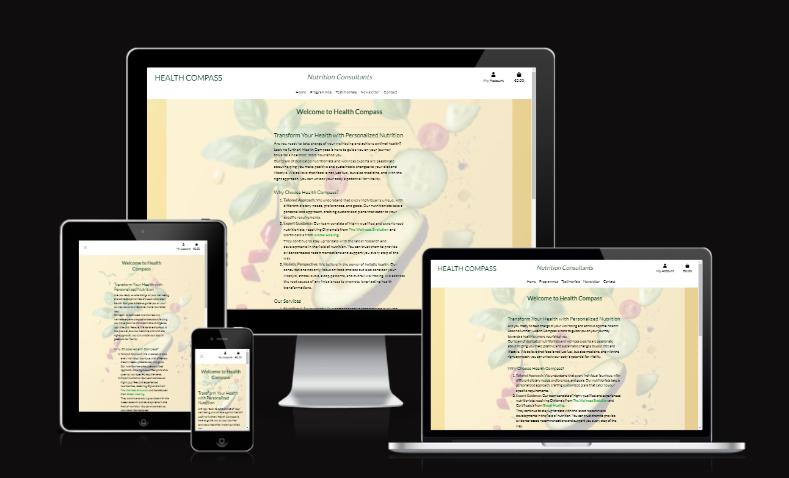

# Health Compass

## A Nutrion and Lifestyle Consultation Site
>A site to purchase nutrition and lifestyle coaching programmes from experienced and qualified nutritionists.



## [Live site](https://health-compass.herokuapp.com/) | [Repository](https://github.com/MichelleCorrigan/health-compass)

---

## Contents
* [Design](#design)
  * [Wireframes](#wireframes)
  * [Images](#images)
* [Technologies Used](#technologies-used)
* [Deployment](#deployment)
* [Testing](#testing)
* [Bugs](#bugs)
* [Credits](#credits)
* [Features to implement in the future](#features-to-implement-in-the-future)
---

## Design

### Wireframes

<details>

 <summary>Home Page</summary>

 

</details>

### Images

A background image of various fruit and vegetables scattered on a yellow background, rendered to 50% transparency, was used across the site.

<details>
 <summary>Background Image</summary>


</details>

---

## Technologies Used

- HTML
- CSS
- JavaScript
- Python
- Django

- ElephantSQL
- Heroku
- Git
- Github

---

## Deployment

### Create an external database
1. Log in to [ElephantSQL](https://www.elephantsql.com/)
2. Click Create New Instance
3. Give your plan a Name, select the free plan, click Select Region
4. Select data-center nearest you, click Review
5. Check all details are correct then click Create Instance
6. Return to dasboard, click on your new database, copy the database URL to your clipboard

### Create Heroku App
1. Log in to [Heroku](https://www.heroku.com)
2. Click New, select New app
3. Name your app, select region closest to you, click Create app
4. In Settings, reveal Config Vars
5. Add a new config var named DATABASE_URL, paste in the URL from ElephantSQL as the value

In your IDE terminal install:
  `pip3 install dj_database_url==0.5.0 psycopg2`
 
Update requirements.txt file:
  `pip freeze > requirements.txt`

Add the DATABASE_URL to your env.py file or environment variables in gitpod

Go to settings.py and  `import dj_database_url` underneath the import for os

Comment out the default  `DATABASES`  setting, add the following underneath:

``` DATABASES = {
    'default': dj_database_url.parse(os.environ.get('DATABASE_URL')) }

```
In the terminal:
1. Run migrations
2. Create a superuser

Return to settings.py and delete the previous Databases entry, un-commenting out the default setting

In the root directory of your project, create a file called "Procfile" and add  `web: gunicorn project_name.wsgi` 
    
In settings.py 
1. Add ['app_name.heroku.com', 'localhost'] to  `ALLOWED_HOSTS`
2. Add the key value of: `DISABLE_COLLECTSTATIC`  and set it to 1. When you have  staticfiles to push then remove this variable
3. Set `DEBUG = 'DEVELOPMENT' in os.environ`
    
Commit and push these changes to GitHub

Then use `git push heroku main` to deploy to Heroku

In the Heroku deploy tab, connect to Github, connect to your repository and enable automatic deploys

In the settings tab, update the config vars with the following:

| Key | Value  |
| -- | -- |
|AWS_ACCESS_KEY_ID|From AWS in CSV Download|
|AWS_SECRET_ACCESS_KEY|From AWS in CSV Download|
|DATABASE_URL|From ElephantSQL dashboard|
|SECRET_KEY|Randomly Generated Django Key|
|USE_AWS|True|

Click on open app at the top of the page to view your deployed app

---

## Testing

### Common Elements Testing
Manual testing was conducted on the following elements:

- Test that Logo redirects to home screen.
- Test that Nav Links work.
- Test that External Links work and open in a new page.
- User registration, login and logout all work.
- CRUD functionality only available when Superuser logged in.
- Invalid forms give error message explaining why it is invalid.
- Valid forms submitted have a success message relayed to user.


### Validation
#### HTML and CSS were validated using the [W3C Validator](https://validator.w3.org/)
  - HTML - all clear
    <details>

      <summary>HTML validation</summary>

      
 
    </details>

  - CSS - all clear
    <details>

      <summary>CSS validation</summary>

      
    
    </details>

#### JavaScript code was tested on [Jshint](https://jshint.com/)
  - JS - no errors

    <details>

      <summary>JavaScript validation</summary>

      
      
    </details>

##### Python was validated using the flake8 linter in the terminal

#### Lighthouse validation was run, with the following results;
 - Showing good scores throughout the site

    <details>

      <summary>Lighthouse validation</summary>

      
      
    </details>
  

#### Browser Validation tested on;
  - Chrome
  - Safari
  - Edge
  - Firefox

#### Responsiveness tested on;
  - Laptop
  - Iphone XS
  - Samsung Galaxy A50

---

## Bugs

- Once deployed, the link to the Programmes page was missing content. After receiving help on Slack, I realised there was no data in the admin panel of production. Once the data was added the page functioned as expected.
- The buttons on the Programmes_details page that were working to begin with, stopped functioning. After multiple troubleshooting attempts, I got help from tutor support, who found that the issue was with the body-height set in css. After deleting this, the buttons are functioning again.

---

## Credits

- Code Institute student template: [gitpod full template](https://github.com/Code-Institute-Org/gitpod-full-template)
- Code Institutes syllabus
- ChatGPT; for content on the Home and Testimonials pages
- Pexels for background image [background image](https://res.cloudinary.com/dqouzgyjm/image/upload/v1680110719/pexels-jj-jordan-7865977_cvtugr.jpg)

- References used:

  - Codemy.com django videos on YouTube
  - Master Code Online newsletter videos on YouTube
  - Stack Overflow
  - Slack
  - Bootstrap
  - Django Docs
  - Cripsy Forms Docs

---

## Features to implement in the future


